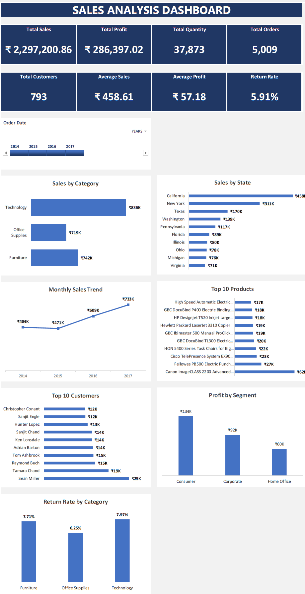
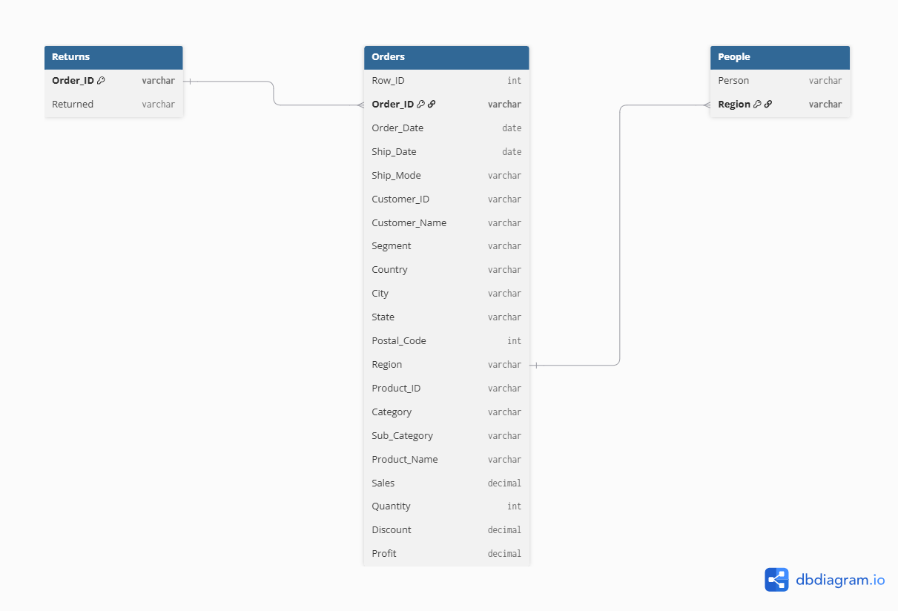

<div align="center">

# 📊 Microsoft Excel Sales Analysis Dashboard

### Advanced Excel Business Analytics Project

**Power Query • Power Pivot • DAX • Pivot Tables • Interactive Dashboard**

End-to-End Sales Analysis Dashboard built using Microsoft Excel to transform raw sales data into meaningful business insights through data cleaning, modelling, visualization, and KPI reporting.

</div>

---

<p align="center">


</p>

---

# 📑 Table of Contents

- Project Overview
- Dashboard Preview
- Business Problem
- Excel Features
- Data Cleaning
- Data Model
- KPIs
- Business Insights
- Excel Skills Demonstrated
- Folder Structure
- Tools Used
- Author

---

# 📌 Project Overview

The Microsoft Excel Sales Analysis Dashboard is an end-to-end business analytics project developed using Advanced Excel.

The project demonstrates the complete analytics workflow, including data cleaning, data transformation, data modelling, KPI calculation, dashboard development, and business insight generation.

The dashboard enables users to interactively analyze sales performance across customers, products, categories, regions, and time periods, helping businesses make data-driven decisions.

---

# 🖼 Dashboard Preview

> **Interactive Sales Dashboard built using Microsoft Excel**



### Dashboard Highlights

- 📊 Dynamic KPI Cards
- 📅 Date-wise Analysis
- 🌍 Region-wise Sales
- 👥 Customer Analysis
- 📦 Product Analysis
- 💰 Profit Analysis
- 📉 Discount Analysis
- 🔄 Return Rate Analysis
- 🎛 Interactive Slicers

---

# 🎯 Business Problem

Organizations generate massive volumes of sales data every day, but extracting meaningful insights from raw data is often challenging.

This project addresses key business questions, including:

- Which products generate the highest sales and profit?
- Which customer segments contribute the most revenue?
- Which regions perform best?
- How do discounts impact profitability?
- Which customers are most valuable?
- What are the monthly sales trends?
- What is the overall return rate?

The dashboard transforms raw transactional data into actionable business insights for informed decision-making.

---

# 📈 Excel Dashboard Features

The dashboard was designed to provide interactive business analysis using Advanced Microsoft Excel.

### Key Features

- 📊 Interactive KPI Dashboard
- 📅 Date-wise Sales Analysis
- 🌍 Region-wise Performance
- 🏷 Category & Sub-Category Analysis
- 👥 Customer Performance Analysis
- 📦 Product Performance Analysis
- 💰 Profit Analysis
- 📉 Discount Impact Analysis
- 🔄 Return Rate Analysis
- 🎛 Interactive Slicers
- 📈 Dynamic Charts
- ⚡ Automated KPI Calculations

---

# 🧹 Data Cleaning (Power Query)

The raw sales dataset was cleaned and transformed using **Microsoft Power Query** before analysis.

### Data Preparation Tasks

- Removed duplicate records
- Checked missing values
- Standardized column names
- Corrected data types
- Formatted date fields
- Validated sales and profit values
- Prepared clean dataset for reporting

Power Query helped automate the data preparation process, ensuring accuracy and consistency for dashboard reporting.

---

# 🧩 Data Model (Power Pivot)

Power Pivot was used to build a relational data model for advanced analysis.

### Tables Included

- Orders
- Returns
- People

### Relationships Created

- Orders → Returns (Order ID)
- People → Orders (Region)

### Benefits

- Improved reporting performance
- Dynamic calculations using DAX
- Relationship-based filtering
- Scalable dashboard design

---

## 📷 Data Model Diagram

The dashboard uses a relational data model built with Power Pivot.



The data model connects the Orders, Returns, and People tables to enable dynamic reporting and DAX calculations.

---

# 📊 Key Performance Indicators (KPIs)

The dashboard includes the following dynamic KPIs calculated using Power Pivot and DAX Measures.

| KPI | Value |
|------|-------:|
| Total Sales | ₹22,97,200.86 |
| Total Profit | ₹2,86,397.02 |
| Total Orders | 5,009 |
| Total Customers | 793 |
| Total Quantity | 37,873 |
| Average Sales | ₹229.86 |
| Average Profit | ₹28.66 |
| Return Rate | 5.91% |

### DAX Measures Used

- Total Sales
- Total Profit
- Total Quantity
- Total Orders
- Total Customers
- Average Sales
- Average Profit
- Return Rate

---

# 💡 Business Insights

The dashboard provides several actionable business insights:

- 📱 Phones generated the highest sales among all sub-categories.
- 📎 Fasteners recorded the lowest sales.
- 👥 Consumer Segment contributed the highest revenue.
- 🌎 California generated the highest sales.
- 💰 Technology category earned the highest profit.
- 📉 Higher discounts reduced overall profitability.
- 🎯 Zero-discount orders generated the maximum profit.
- 📅 November recorded the highest monthly sales.
- 🔄 Overall Return Rate was approximately **5.91%**.
- ⭐ Top customers contributed a significant share of total revenue.

These insights help management identify growth opportunities, improve profitability, and support better business decisions.

---

# 🛠 Excel Skills Demonstrated

This project demonstrates proficiency in:

- Advanced Microsoft Excel
- Power Query
- Power Pivot
- Data Modelling
- DAX Measures
- Pivot Tables
- Pivot Charts
- Interactive Slicers
- KPI Dashboard Design
- Business Analysis
- Data Visualization
- Dashboard Development
- Data Cleaning
- Data Transformation
- Business Reporting

---

# 📂 Folder Structure

```text
02-Excel/
│
├── Dashboard.xlsx
├── Dashboard Screenshots
├── Supporting Files
└── README.md
```

---

# 🛠 Tools Used

| Tool | Purpose |
|------|---------|
| Microsoft Excel | Dashboard Development |
| Power Query | Data Cleaning |
| Power Pivot | Data Modelling |
| DAX | KPI Calculations |
| Pivot Tables | Business Analysis |
| Pivot Charts | Data Visualization |

---

# 👨‍💻 Author

**Sunil Kumar**

Aspiring Data Analyst

### Skills

- Microsoft Excel
- SQL (MySQL)
- Power BI
- Python
- Data Analysis
- Business Intelligence
- Git & GitHub

---

# 📜 License

This project is licensed under the **MIT License**.

---

<div align="center">

### ⭐ Thank you for visiting this Excel Project

If you found this project useful, consider giving this repository a ⭐ on GitHub.

**Happy Learning! 🚀**

</div>