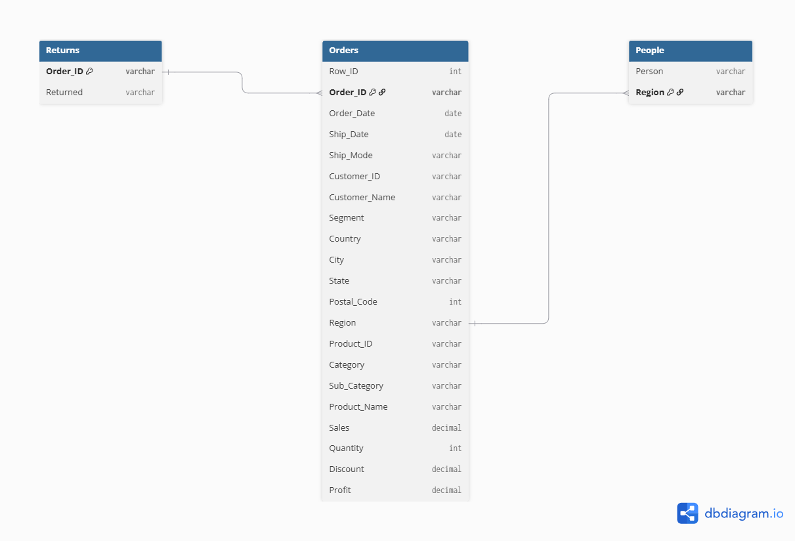
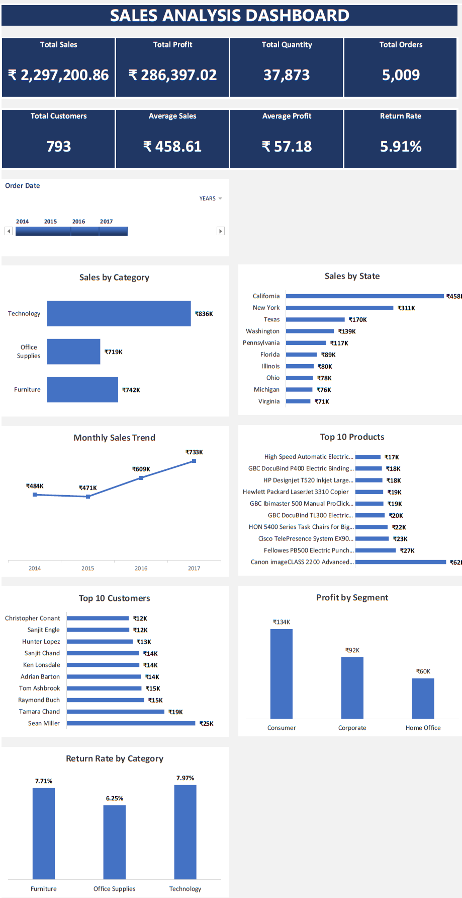

## 📊 Excel Data Model

This project uses Excel Power Pivot Data Model to create relationships between multiple tables.

### Relationships

- Orders → Returns (Order_ID)
- Orders → People (Region)

### Data Model Diagram

# 📊 Sales Analysis Dashboard
> End-to-End Data Analysis Project using Advanced Excel

## 🚀 Live Project

## 📊 Dashboard Preview

- 📂 Excel Dashboard
- 📄 PDF Report
- 📈 Interactive Analysis

---

## 🛠️ Tools Used

- Microsoft Excel
- Pivot Tables
- Power Pivot
- Data Model
- GETPIVOTDATA
- Slicers
- Timeline

## 📌 Project Overview

This project is an interactive Sales Analysis Dashboard built in Microsoft Excel using Pivot Tables, Power Pivot (Data Model), Slicers, Timeline, and Dynamic KPIs.

The dashboard helps business users monitor sales performance, profitability, customer behavior, product performance, and return rates through interactive visualizations.

---

## 🎯 Business Problem

Businesses generate thousands of sales records every year, making it difficult to identify:

- Best selling products

- Top customers

- High revenue states

- Profitability by segment

- Monthly sales trend

- Return rate analysis

This dashboard solves these problems by providing an interactive executive-level reporting solution.

---

## 📈 Dashboard Preview

!\[Dashboard](06-Images/Dashboard\_Preview.png)

---
## 📥 Download Files

📊 **Excel Dashboard:** [Download Excel](https://github.com/01NARWAR/Sales-Analysis-Dashboard/raw/refs/heads/main/02-Excel/Final%20Dashboard/Sales_Analysis_Dashboard_Final.xlsx)
📄 **PDF Report:** [Download PDF](https://github.com/01NARWAR/Sales-Analysis-Dashboard/raw/refs/heads/main/07-Documents/Sales_Analysis_Dashboard_Final.pdf)

📁 **Dataset:** [Sample Superstore](https://github.com/01NARWAR/Sales-Analysis-Dashboard/raw/refs/heads/main/01-Dataset/Superstore.xlsx)
---

## 📊 KPIs

- Total Sales

- Total Profit

- Total Quantity Sold

- Total Orders

- Total Customers

- Average Sales

- Average Profit

- Return Rate

---

## 📉 Dashboard Features

- Interactive Slicers

- Timeline Filter

- Dynamic KPI Cards

- Sales by Category

- Sales by State

- Monthly Sales Trend

- Top 10 Products

- Top 10 Customers

- Profit by Segment

- Return Rate by Category

---

## 💡 Key Business Insights

- Technology generated the highest sales.

- California recorded the highest sales.

- Consumer segment generated the highest profit.

- Canon imageCLASS 2200 was the top-selling product.

- Sean Miller was the highest revenue customer.

- Overall return rate was 5.91%.

---

## 🛠 Tools Used

- Microsoft Excel

- Pivot Tables

- Power Pivot

- Data Model

- Pivot Charts

- Timeline

- Slicers

- GETPIVOTDATA

- Dashboard Design

---

## 📂 Project Structure

01-Dataset/

02-Excel/

03-SQL/

04-PowerBI/

05-Python/

06-Images/

07-Documents/

---

## 🚀 Future Improvements

- SQL Version

- Power BI Dashboard

- Python Analysis

- Forecasting

- Customer Segmentation

---

## 👤 Author

Sunil Kumar

Aspiring Data Analyst

